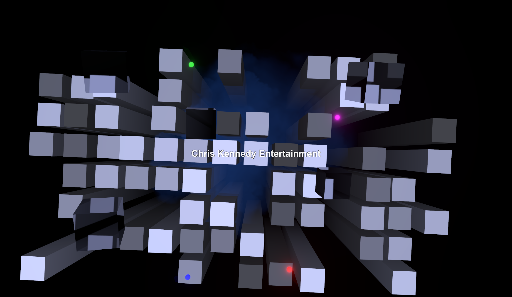
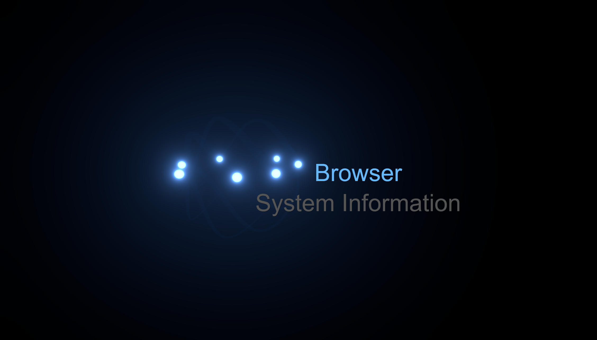

# My Personal Site




Welcome to my personal website! This project showcases my portfolio, projects, and technical skills. It emulates the PS2 start screen with 3D graphics and animations, built using modern web technologies.

---

## 🚀 Tech Stack

This project is built with:

- **[Astro](https://astro.build/)**: A modern static site generator optimized for performance.
- **[TypeScript](https://www.typescriptlang.org/)**: For type-safe JavaScript development.
- **[React Three Fiber](https://docs.pmnd.rs/react-three-fiber/getting-started/introduction)**: For rendering 3D graphics in the browser.
- **[Copilot](https://github.com/features/copilot)**: An LLM to write my readme for me

---

## 🌟 Features

- **3D Graphics**: Inspired by the PS2 start screen, with animations and interactivity.
- **Modern Web Development**: Built with Astro for fast, optimized static site generation.
- **Responsive Design**: Works seamlessly across devices.
- **Showcase of Projects**: Highlights my portfolio and personal projects.

---

## 📂 Project Structure

The project follows the standard Astro structure:

```text
/
├── public/                # Static assets (e.g., images, icons)
│   └── favicon.svg
├── src/
│   ├── assets/            # Project-specific assets
│   │   └── astro.svg
│   ├── components/        # Reusable UI components
│   │   └── Welcome.astro
│   ├── layouts/           # Layout components for pages
│   │   └── Layout.astro
│   └── pages/             # Site pages
│       └── index.astro    # Homepage
└── [package.json]         # Project dependencies and scripts
```
